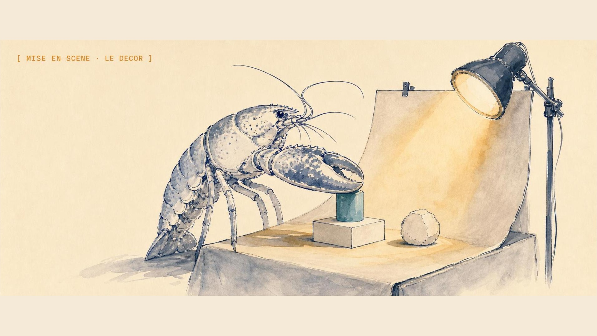

<p align="center">
  
</p>

<h1 align="center">Mise en Scene</h1>

<p align="center">
  <strong>Turn source material into self-contained interactive technical explainers.</strong>
</p>

<p align="center">
  
  
  
  
</p>

<p align="center">
  <a href="https://mise-en-scene.escoffierlabs.dev"><strong>Website</strong></a> ·
  <a href="https://app.mise-en-scene.escoffierlabs.dev"><strong>Studio</strong></a>
</p>

Mise en Scene is a browser tool that turns a repo, an OpenAPI spec, a README, an
incident report, or architecture notes into an editable HTML/SVG technical
explainer you can hand to anyone. It extracts the systems, actors, flows, terms,
and source-grounded facts, then renders an interactive scene with audience-mode
chips and click targets. Unlike a static diagram editor, the same `SceneSvg`
component drives both the live studio and the export, so a one-file standalone
HTML artifact always looks exactly like what you built.

## What it does

Mise en Scene is an interactive diagram and explainer generator for software
documentation. Paste source material and it builds a scene model (systems,
actors, flows, terms, and the facts that back each one), then renders an
editable SVG explainer in the browser. Four audience modes reframe the same
scene for engineers, execs, students, or customers, and click targets let a
reader drill into any node. When you are done, export a single standalone HTML
file. The export is rendered from the same `SceneSvg` React component the studio
uses (via `renderToStaticMarkup`), so the artifact you send matches the scene
you saw, with no separate render path to drift out of sync.

## Quickstart

```bash
git clone https://github.com/escoffier-labs/mise-en-scene.git
cd mise-en-scene
npm install
npm run dev
```

The dev server prints a local URL on startup. Open it in your browser, paste
source material into the studio, edit the scene, and export a standalone HTML
artifact.

To build and preview a production bundle:

```bash
npm run build      # tsc -b && vite build
npm run preview    # serves the production build locally
```

The single verification gate is `./scripts/verify`, which runs `tsc -b && vite
build`. CI runs the same command on every push and pull request.

## Code layout

- `src/App.tsx`: scene model, extraction heuristics, the `SceneSvg` component,
  and the app shell.
- `src/sceneStyles.ts`: styles for the SVG internals (injected inside the SVG)
  plus the page chrome for the exported artifact.
- `src/index.css`: app shell layout and controls.

## Why not a general diagram editor?

- **Excalidraw, draw.io, and friends** are freeform canvases. You place every
  box by hand and nothing connects the drawing back to the source. Mise en Scene
  starts from your actual source material and keeps the scene grounded in
  extracted facts.
- **Mermaid and PlantUML** turn text into a fixed diagram, but the output is a
  static picture with one audience in mind. Mise en Scene renders an editable,
  interactive scene with audience-mode chips and click targets, and exports it as
  a self-contained interactive HTML file rather than a flat image.
- **Slide decks and screenshots** go stale the moment the system changes and
  carry no structure a reader can explore. A Mise en Scene export is one HTML
  file, openable anywhere, with the scene model behind it.

## What Mise en Scene is not

Mise en Scene is an early working spike, not a finished product.

It is not:

- a hosted service or an account-gated SaaS (it runs in your browser)
- a full repo or API crawler yet (ingestion is local text heuristics for now)
- a screenshot or recorded-walkthrough exporter yet (those export targets are
  planned, not implemented)
- a replacement for hand-authored long-form docs

## Status

This is an early working spike. The studio, scene model, audience modes, and the
standalone HTML export work today. Not implemented yet: screenshot and
recorded-walkthrough export targets, and any real ingestion beyond the local
text heuristics.

## Naming

Use ASCII slugs without accents:

- repo/app slug: `mise-en-scene`
- package-safe variant: `mise_scene`
- display name: `Mise en Scene` or polished mark `Mise en scène`

Part of the [Escoffier Labs](https://mise-en-scene.escoffierlabs.dev) kitchen.

## Contributing

Bug reports and patches are welcome. See [CONTRIBUTING.md](CONTRIBUTING.md) for
the contribution path and [CODE_OF_CONDUCT.md](CODE_OF_CONDUCT.md) for community
expectations. Security reports go through [SECURITY.md](SECURITY.md), not public
issues.

## License

MIT. See [LICENSE](LICENSE).
