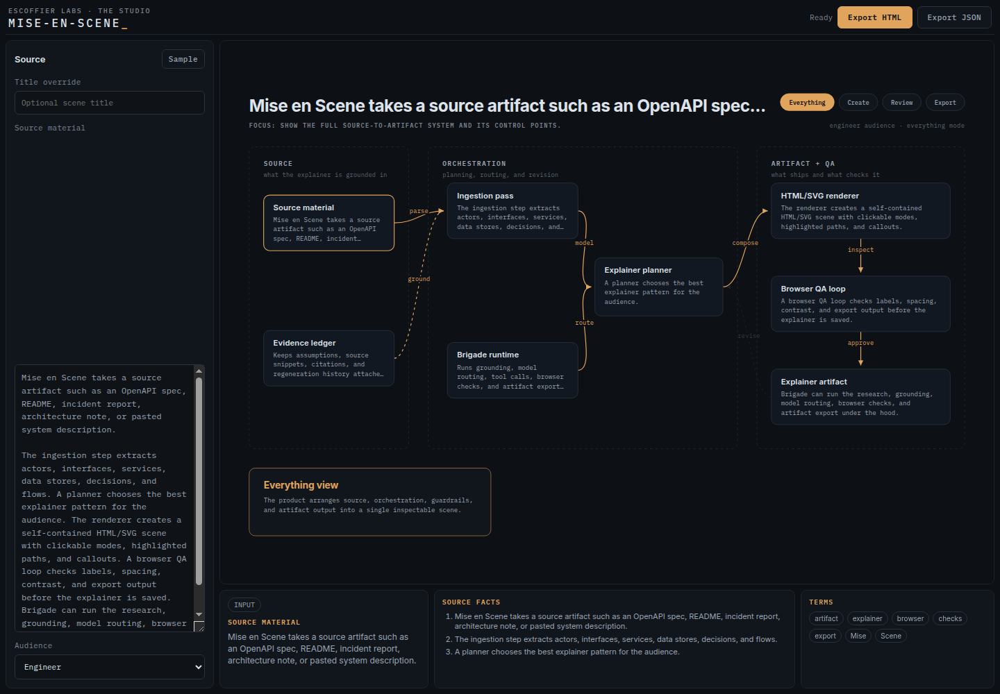

<p align="center">
  
</p>

<h1 align="center">Mise en Scene</h1>

<p align="center">
  
</p>

<p align="center">
  <strong>Turn a repo or incident report into an interactive explainer you can ship.</strong>
</p>

<p align="center">
  Browser studio that extracts systems, actors, and source-grounded facts into editable HTML/SVG scenes. Same component for live preview and standalone export.
</p>

<p align="center">
  <a href="https://mise-en-scene.escoffierlabs.dev">Website</a> &middot; <a href="https://app.mise-en-scene.escoffierlabs.dev">Studio</a> &middot; <a href="#install">Install</a>
</p>

<p align="center">
  
  
  
</p>

## Install

```bash
git clone https://github.com/escoffier-labs/mise-en-scene.git
cd mise-en-scene
# follow package.json scripts for studio dev server
npm install && npm run dev
```

## What it does

| | Job | What you get |
|---|---|---|
| **Ingest** | Source material | Plain text, relationship lines, OpenAPI JSON |
| **Extract** | Source-grounded facts | Systems, actors, flows, terms, and evidence ranges |
| **Stage** | Interactive scene | Architecture and sequence views, editing, review |
| **Export** | Portable artifacts | Interactive HTML, editable JSON, static SVG |

<p align="center">
  
</p>

<p align="center"><em>Studio on the left, scene on the right. Standalone export uses the same SceneSvg component.</em></p>


## Source grammar

Paste prose, Markdown, OpenAPI JSON, or explicit relationships:

```text
Browser -> API: sends request
API -> Database: reads rows
```

Relationship lines produce deterministic blocks, edges, and source evidence.
OpenAPI JSON produces API, tag, and operation elements. When the source does not
contain a usable relationship, the studio clearly marks its fallback scene.

JSON exports use a validated, versioned schema and can be imported for another
editing session. HTML exports work offline and retain view switching and element
inspection. SVG exports contain the active view and no scripts.

## Code layout

- `src/App.tsx`: studio state, import, editing, provenance, and export actions.
- `src/components/SceneSvg.tsx`: shared architecture and sequence renderer.
- `src/scene/types.ts`: versioned scene model and editing helpers.
- `src/scene/extract.ts`: plain-text and OpenAPI JSON extraction.
- `src/scene/layout.ts`: deterministic architecture and sequence layouts.
- `src/scene/validate.ts`: imported JSON validation.
- `src/scene/exports.tsx`: standalone HTML and SVG serialization.
- `src/sceneStyles.ts`: styles for the SVG internals (injected inside the SVG)
  plus the page chrome for the exported artifact.
- `src/index.css`: app shell layout and controls.

## Why not a general diagram editor?

- **Excalidraw, draw.io, and friends** are freeform canvases. You place every
  box by hand and nothing connects the drawing back to the source. Mise en Scene
  starts from your actual source material and keeps the scene grounded in
  extracted facts.
- **Mermaid and PlantUML** turn text into a fixed diagram, but the output is a
  static picture with one audience in mind. Mise en Scene renders an editable,
  interactive scene with audience-mode chips and click targets, and exports it as
  a self-contained interactive HTML file rather than a flat image.
- **Slide decks and screenshots** go stale the moment the system changes and
  carry no structure a reader can explore. A Mise en Scene export is one HTML
  file, openable anywhere, with the scene model behind it.

## What Mise en Scene is not

Mise en Scene is an early working spike, not a finished product.

It is not:

- a hosted service or an account-gated SaaS (it runs in your browser)
- a full repository crawler (ingestion remains pasted, browser-local input)
- an OpenAPI YAML parser (paste JSON for structured OpenAPI extraction)
- a screenshot or recorded-walkthrough exporter
- a replacement for hand-authored long-form docs

## Status

This is an early working product. Source-derived scenes, evidence inspection,
architecture and sequence views, JSON round trips, editing, and HTML/SVG export
work today. Repository crawling, OpenAPI YAML, screenshots, and recorded
walkthroughs are not implemented.

## Naming

Use ASCII slugs without accents:

- repo/app slug: `mise-en-scene`
- package-safe variant: `mise_scene`
- display name: `Mise en Scene` or polished mark `Mise en scène`

Part of the [Escoffier Labs](https://mise-en-scene.escoffierlabs.dev) kitchen.

## Contributing

Bug reports and patches are welcome. See [CONTRIBUTING.md](CONTRIBUTING.md) for
the contribution path and [CODE_OF_CONDUCT.md](CODE_OF_CONDUCT.md) for community
expectations. Security reports go through [SECURITY.md](SECURITY.md), not public
issues.

## License

MIT. See [LICENSE](LICENSE).
